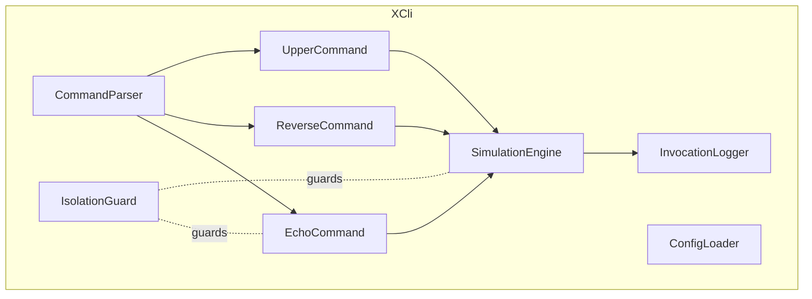

# Component View (selected internals)

Testing seams

Commands unit‑tested (happy/negative paths); SimulationEngine boundary tests.

Logger JSON shape verified; IsolationGuard policy tests ensure no side‑effects.
